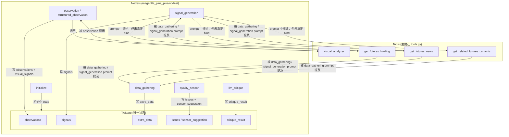

# ApexLi LangGraph 项目当前架构概览 (C4 风格)

**生成时间**: 2026-07-09  
**目的**: 理清当前代码结构、TAState 定义、Node 与 Tool 的关系，为后续重构提供清晰地图。

---

## 1. TAState 结构定义（核心数据容器）

`TAState` 是整个 Agent 的**唯一状态载体**（TypedDict），目前散落在多个节点中读写，没有集中定义。

### 关键字段汇总（从代码中反向提取）：

| 字段 | 类型 | 主要写入者 | 主要读取者 | 说明 |
|------|------|------------|------------|------|
| `iteration` | int | graph / initialize | 所有 node | 当前轮次 |
| `current_symbol` | str | initialize | 所有 node | 当前交易品种 |
| `observations` | list[dict] | observation | signal_generation, llm_critique, quality_sensor | 每轮结构化观察结果 |
| `signals` | list[dict] | signal_generation | llm_critique, quality_sensor, final_output | 生成的交易信号 |
| `issues` | list[str] | quality_sensor | llm_critique | 质量传感器发现的问题 |
| `extra_data` | dict | data_gathering | observation, signal_generation | 额外工具数据（holding, news, related 等） |
| `confidence` | float | signal_generation | quality_sensor, llm_critique | 当前信号置信度 |
| `messages` | list | initialize | llm_critique, signal_generation | 系统 prompt + 历史对话 |
| `market_data` | dict | data_gathering / initialize | observation | 日线数据等 |
| `current_playbook` | str | initialize | observation, signal_generation | 当前使用的 Playbook (v3 / zen) |
| `playbook_used` | bool | initialize | final_output | 是否使用了 Playbook |
| `critique_result` | dict | llm_critique | - | LLM 审查结果（score, should_continue 等） |
| `sensor_suggestion` | dict | quality_sensor | llm_critique | 质量传感器给 critique 的建议 |
| `risk_assessment` | dict | quality_sensor | - | 风险评估结果 |
| `visual_signals` | list | observation (via visual_analyzer) | signal_generation | 视觉分析产生的信号 |
| `is_cached_image` | bool | observation | llm_critique | 是否复用了缓存图像 |

**问题**：TAState 没有集中定义文件，字段散落在各节点中，容易出现不一致。

---

## 2. 当前 Tools 现状

### 主要工具函数位置：

**文件**: `eaagent/a_plus_plus/tools.py`

已明确标注为 "LLM tool" 的函数（但**均未使用 `@tool` 装饰器**）：

- `get_futures_holding(ts_code)` — 持仓排名
- `get_futures_basic(exchange)` — 合约基本信息
- `get_related_futures_dynamic(symbol)` — 相关品种
- `get_futures_news(symbol, limit)` — 新闻
- `visual_analyzer(symbol, months, force_new, playbook_name)` — **最重要**的视觉K线分析工具（内部调用 Grok Vision + Playbook）

其他辅助函数（未作为 Tool）：
- `get_futures_klines`, `get_structured_observation`, `calculate_atr` 等（主要被 observation 内部使用）

**问题**：
- Tools 以普通函数形式存在于 `tools.py` 中，没有统一注册为 LangChain Tool。
- `visual_analyzer` 有复杂的缓存机制（`_observation_cache`），但未暴露为标准 Tool。
- 部分 Tool 有循环导入问题（`get_related_futures_dynamic` 导入了 data_gathering）。

---

## 3. Node 与 Tool 交互关系（Mermaid 图）

**当前实际调用方式**：
- **observation**：直接 Python 调用 `visual_analyzer`（不是 Tool Calling）
- **signal_generation / data_gathering**：prompt 中写 "可用工具列表"，靠 LLM 自己输出 JSON，之后手动解析（**伪 Tool Calling**）

---

## 4. 当前架构合理性分析

### 优点
- 多轮迭代框架基本成型（observation → signal_generation → quality_sensor → llm_critique → 可能继续）
- visual_analyzer 的缓存机制设计较好（避免重复生成相同图像）
- Playbook 驱动的思路清晰（所有 prompt 都尽量引用当前 Playbook）

### 主要问题（高优先级）

| 问题 | 严重程度 | 影响 |
|------|----------|------|
| **Tools 未真正 @tool 化** | ★★★★★ | 无法使用 LangGraph 原生 ToolNode + bind_tools，全部靠 prompt 描述 + 手动解析 |
| **TAState 没有集中定义** | ★★★★ | 字段散落，容易不一致，难以做类型检查 |
| **signal_generation prompt 过于臃肿** | ★★★★★ | 超过 150 行，包含工具描述、Few-shot、JSON schema，难以维护 |
| **观察与信号生成耦合严重** | ★★★★ | observation 已经做了很多信号生成的工作，signal_generation 重复劳动 |
| **多轮迭代的 "记忆" 能力弱** | ★★★ | llm_critique 有前后轮对比，但 signal_generation 几乎不利用历史信号 |
| **错误处理分散且脆弱** | ★★★ | 每个节点都有自己的 try-except + 默认值 |

### 建议的重构方向（高层）

1. **立即**：把 `tools.py` 中的函数包装成 `@tool`
2. **短期**：把 `signal_generation` 的 prompt 大幅瘦身 + 支持真实 bind_tools
3. **中期**：把 `observation` 和 `signal_generation` 的职责更清晰分离
4. **长期**：引入 `ToolNode` + 条件边，实现真正的 ReAct 风格多轮工具调用

---

## 5. 后续行动建议

基于以上分析，**下一个最该生成计划的文件是 `tools.py`**（因为它是所有 Tool Calling 的根基）。

你现在想：
- A. 先下载上面 4 个文件看内容
- B. 直接开始生成 `tools.py` 的两个计划（plan + with_test）
- C. 对架构文档有修改意见

请直接回复字母或具体要求。