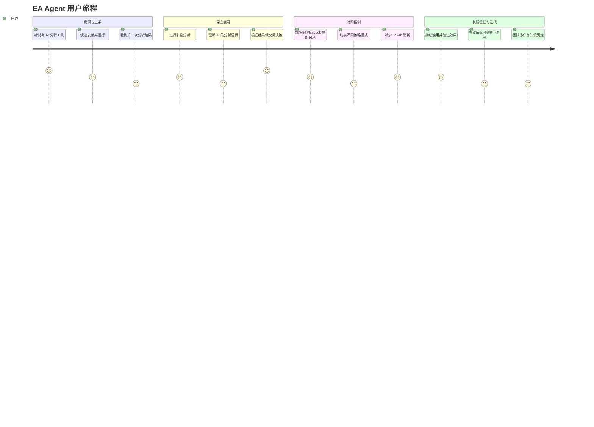

# EA Agent - User Journey & Stories

## 1. 用户旅程地图（User Journey Map）

**核心用户**：期货交易者（有一定技术分析基础，希望用 AI 辅助决策）

### 详细用户旅程表格

| 阶段 | 用户目标 | 用户行为 / 思考 | 当前痛点 / 机会 | 我们的解决方案（Epic） | 关键成功指标 |
|------|----------|------------------|------------------|------------------------|--------------|
| **1. 发现与上手** | 快速验证工具是否有价值 | 安装 → 运行 → 看结果 | 不知道分析质量如何、结果是否可信 | **Journey 1: 快速上手 + 透明输出** | 用户能在 5 分钟内看到有结构的结果 |
| **2. 进行分析** | 获得有参考价值的交易建议 | 启动分析 → 查看每轮过程 → 得到最终建议 | 一次分析可能不够准，想继续优化但操作麻烦 | **Journey 2: 多轮智能分析闭环** | 系统能自动进行多轮优化，用户可理解过程 |
| **3. 控制分析风格** | 根据市场环境调整分析策略 | 想用更保守/激进的 Playbook 风格 | Playbook 太长、Token 贵、无法灵活控制 | **Journey 3: Playbook Strategy 灵活控制** | 用户能通过简单配置切换策略 |
| **4. 建立信任** | 理解 AI 为什么给出这个结论 | 查看分析依据、量价逻辑、Playbook 引用 | 黑盒输出，不知道逻辑链条 | **Journey 4: 结构化 + 可追渲的 LLM 沟通** | 每条结论都能追渲到具体观察和 Playbook 规则 |
| **5. 持续使用** | 长期依赖这个工具辅助决策 | 频繁使用、根据反馈迭代策略 | 系统难维护、日志混乱、扩展困难 | **Journey 5: 可维护架构 + 可观测性** | 开发者能轻松新增节点和策略，用户能清晰理解每轮分析 |

---

## 2. Story Mapping 与发布计划

**Backbone** (主干)：用户使用 EA Agent 进行一次完整的技术分析

**Walking Skeleton** (行走骨骼)：能跑通的最小可工作流程
- 用户能用 Mock 数据跑通一次完整分析流程
- 输出包含方向、入场、止损、理由的结构化结果
- 有基础的日志输出

**Release 规划**

| Release | 名称           | 包含的 Epic                  | 目标价值                     | 建议时间 |
|---------|--------------------|------------------------------------|---------------------------------------|-------------|
| **MVP** | 基础可用版 | Epic 1 + Epic 2 部分           | 用户能跑通结构化多轮分析 | 第1周    |
| **R1**  | Playbook 策略版 | Epic 3                             | 用户能灵活控制分析风格与成本 | 第2周    |
| **R2**  | 可观测性增强版 | Epic 4                             | 用户能清晰理解分析过程     | 第3周    |
| **R3**  | 工程化完善版 | Epic 5 + 剩余节点拆分   | 系统长期可维护、可扩展       | 第4周    |

---

## 3. User Stories (正式格式)

### Epic 1: 结构化 LLM 沟通 (P0)

**EA-001: 结构化市场观察输出**

**As a** 期货交易者  
**I want** 系统输出的市场观察是结构化的（包含趋势、关键位、量价关系、结论等）  
**So that** 我能快速理解当前市场状态，而不是阅读大段文字。

**验收标准**
- [ ] `structured_observation` 返回符合指定 JSON Schema 的结构化数据
- [ ] 包含 `trend`、`key_levels`、`volume_analysis`、`conclusion`、`risk_note`、`playbook_references` 等字段
- [ ] JSON 解析失败时有拡底处理机制
- [ ] 结构化结果被正确存入 `state["observations"]`
- [ ] 最终报告中以清晰格式展示结构化观察结果

**Priority**: P0  |  **Size**: M

---

**EA-002: 结构化交易信号输出**

**As a** 交易系统  
**I want** `signal_generation` 输出结构化的交易建议（方向、入场、止损、理由）  
**So that** 下游组件和人工 review 能可靠消费结果。

**验收标准**
- [ ] 输出包含 `direction`、`entry_zone`、`stop_loss`、`target`、`reason` 的 JSON
- [ ] `reason` 字段需引用 Playbook 相关逻辑
- [ ] JSON 解析失败时有拡底结构
- [ ] 最终报告中以结构化方式展示交易建议

**Priority**: P0  |  **Size**: M

---

**EA-003: 结构化 Critique 判断**

**As a** 系统  
**I want** `llm_critique` 能引用结构化 Observation 中的关键信息进行判断  
**So that** 继续/停止的决策更有依据。

**Priority**: P1  |  **Size**: S

---

### Epic 2: 多轮智能分析闭环 (P0)

**EA-004: 智能多轮分析控制**

**As a** 交易者  
**I want** 系统能在分析质量不足时自动进行下一轮分析  
**So that** 我能获得更可靠的结论，而不需要手动干预。

**验收标准**
- [ ] `quality_sensor` 能检测“观察数据不足”和“置信度偏低”
- [ ] `llm_critique` 能基于当前结果判断是否继续
- [ ] 系统可自动进入下一轮，最多不超过最大轮次
- [ ] 最终报告中展示实际进行的分析轮次

**Priority**: P0  |  **Size**: L

---

**EA-005: 最终报告展示多轮分析路径**

**As a** 交易者  
**I want** 在最终报告中看到完整的多轮分析过程  
**So that** 我能理解系统是如何逐步优化的。

**Priority**: P1  |  **Size**: M

---

### Epic 3: Playbook Strategy 灵活控制 (P1)

**EA-006: 支持 Core Rules 策略**

**As a** 交易者  
**I want** 能通过配置使用精简核心规则而不是完整 Playbook  
**So that** 在分析质量和 Token 消耗之间取得平衡。

**Priority**: P1  |  **Size**: M

---

**EA-007: 多轮中展示当前 Playbook 策略**

**As a** 交易者  
**I want** 在分析过程中看到当前使用了哪种 Playbook 策略  
**So that** 我能理解分析依据。

**Priority**: P2  |  **Size**: S

---

### Epic 4: 可观测性与用户体验 (P1)

**EA-008: Console 输出颜色区分**

**As a** 交易者  
**I want** 控制台输出使用颜色区分不同轮次和组件  
**So that** 我能更清晰地阅读分析过程。

**Priority**: P1  |  **Size**: M

---

**EA-009: Sensors 检查结果突出显示**

**As a** 交易者  
**I want** Sensors 检查结果在有问题时用醒目颜色显示  
**So that** 我能快速关注风险点。

**Priority**: P1  |  **Size**: S

---

### Epic 5: 工程化与可维护性 (P2)

**EA-010: 节点模块化拆分**

**As a** 开发者  
**I want** 分析节点被拆分成独立模块  
**So that** 新增或修改某个分析步骤时不会影响其他部分。

**Priority**: P2  |  **Size**: L

---

## 4. 优先级与 Roadmap

| Priority | Epic                              | 建议 Release |
|----------|-----------------------------------|------------------|
| P0       | Structured LLM Communication      | MVP              |
| P0       | Multi-round Analysis Loop         | MVP              |
| P1       | Playbook Strategy                 | R1               |
| P1       | Observability                     | R2               |
| P2       | Engineering                       | R3               |