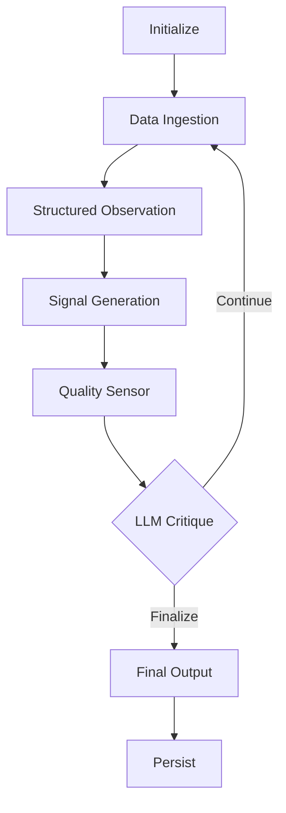

# Multi-round Analysis Loop

## 设计目标
让系统能够像有经验的分析师一样，在发现问题时主动进行多轮迭代分析，而不是只输出一次结果。

## 核心流程

## 关键组件

| 组件              | 职责                           | 当前实现位置             |
|---------------------|------------------------------------|------------------------------------------|
| `quality_sensor`    | 检测数据质量和置信度 | `nodes/quality_sensor.py`                |
| `llm_critique`      | 判断是否需要继续下一轮 | `graph.py` (计划拆分)            |
| `should_continue`   | 控制流程是否进入下一轮 | `graph.py`                               |

## 设计原则

- 优先使用结构化 Observation 作为判断依据
- 每轮分析应有明确的目标
- 避免无效循环（设置最大轮次）